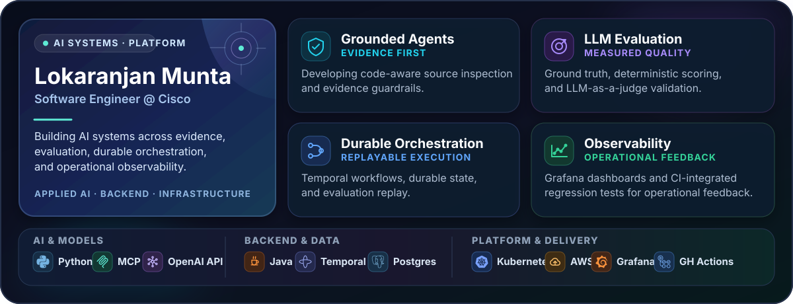

<picture>
  <source media="(max-width: 600px)" srcset="assets/profile-system-mobile.svg">
  
</picture>

Software engineer at Cisco building evidence-grounded agent workflows, LLM evaluation pipelines, distributed orchestration, and operational observability.

**Open to:** Backend · Applied AI / AI Platform · Infrastructure · Forward-Deployed Engineering

## Selected engineering work

<table>
  <tr>
    <td width="31%"><strong>🔌 Couchbase JetBrains Plugin</strong> OPEN SOURCE · JAVA/SWING</td>
    <td>Built a dialog and runner for configuring, executing, and stopping Couchbase Pillowfight workloads from JetBrains IDEs. <strong><a href="https://github.com/Couchbase-Ecosystem/couchbase_jetbrains_plugin/pull/20">View merged PR #20 →</a></strong></td>
  </tr>
  <tr>
    <td><strong>🗺️ Along The Way</strong> TEAM CONTRIBUTION · REACT/TYPESCRIPT</td>
    <td>Implemented route-aware discovery, detour filtering, Google Maps and Places integration, Gemini assistance, and Firebase-backed persistence. <strong><a href="https://github.com/JustChung/along-the-way/pulls?q=is%3Apr+author%3Aloki1001+is%3Amerged">Explore five merged PRs →</a></strong></td>
  </tr>
  <tr>
    <td><strong>🥘 MealMate</strong> APPLIED AI · DJANGO</td>
    <td>Built pantry-aware recipe generation, authenticated recipe storage, and recipe-scoped cooking assistance. <strong><a href="https://github.com/loki1001/MealMate">Explore the project →</a></strong></td>
  </tr>
  <tr>
    <td><strong>⚛️ QuantumGameHub</strong> QUANTUM COMPUTING · QISKIT</td>
    <td>Created four simulator-backed demos exploring interference, entanglement, Bernstein–Vazirani, and measurement-driven art. <strong><a href="https://github.com/loki1001/QuantumGameHub">Explore the project →</a></strong></td>
  </tr>
</table>

## Working stack

- **Agents and evaluation:** Python · OpenAI API · TensorFlow/Keras · Model Context Protocol (MCP)
- **Backend and orchestration:** Java · TypeScript · Django · Temporal · PostgreSQL
- **Platform and operations:** Kubernetes · AWS · Grafana · GitHub Actions

## Connect

[LinkedIn](https://www.linkedin.com/in/lokaranjanm/)
